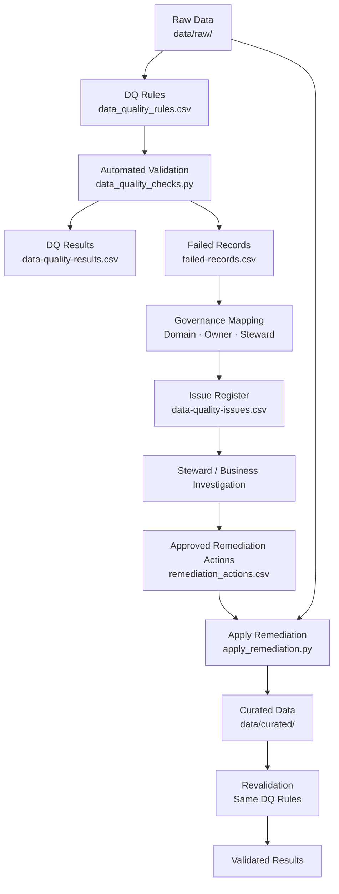
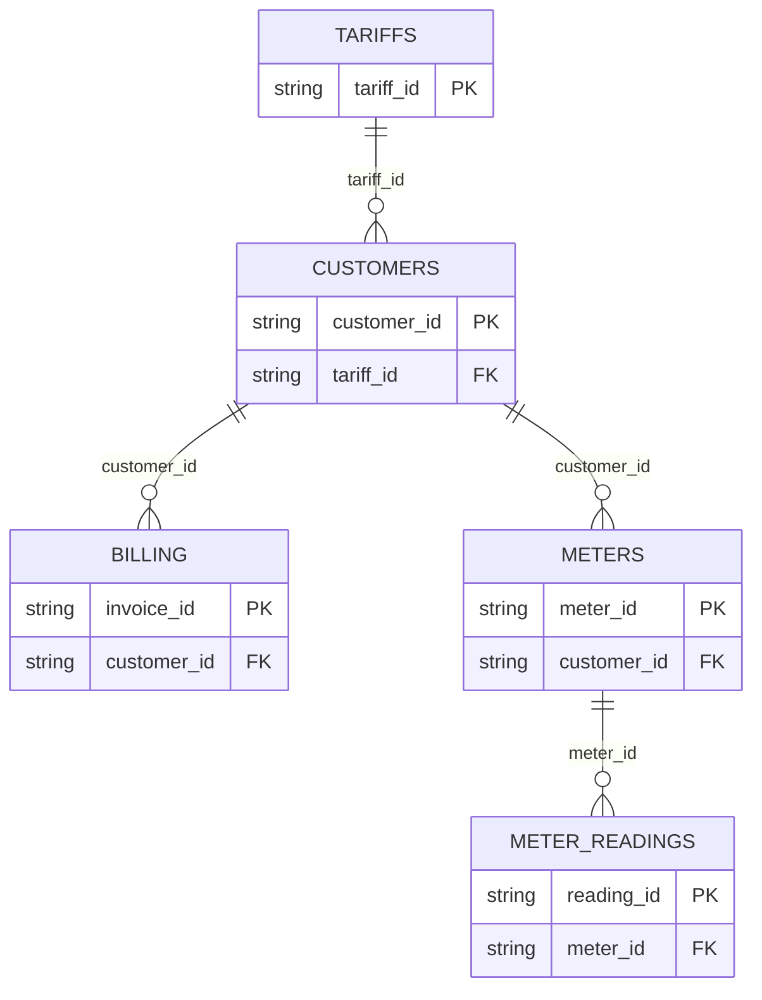

# Energy Data Governance | Microsoft Purview & Python


## Overview

Data governance project built around **five synthetic energy
datasets** governed across four business data domains: **Customer,
Billing, Metering, and Tariff**.

The project implements a governance framework covering **business
glossary design, data ownership and stewardship, classification, access
controls, data quality monitoring, issue management, remediation, and
governance KPIs**.

A configuration-driven Python framework automates data quality
validation, failed-record detection, issue generation, remediation
execution, and revalidation. The governance design is mapped to
corresponding Microsoft Purview capabilities.

Raw datasets intentionally retain selected data quality issues. Approved
remediation actions are applied to separate curated datasets, preserving
the original source state while demonstrating a reproducible governance
and validation workflow.

## Table of Contents

-   [Architecture](#architecture)
-   [Data Domains](#data-domains)
-   [Governance Documentation](#governance-documentation)
-   [Configuration-Driven Data Quality Framework](#configuration-driven-data-quality-framework)
-   [Data Quality Governance Workflow](#data-quality-governance-workflow)
-   [Data Quality Results](#data-quality-results)
-   [Microsoft Purview Mapping](#microsoft-purview-mapping)
-   [Azure and Microsoft Purview Environment](#azure-and-microsoft-purview-environment)
-   [Project Structure](#project-structure)
-   [How to Run](#how-to-run)
-   [Limitations / Production Considerations](#limitations--production-considerations)

## Architecture

The project separates automated data quality processing from governance decisions. Raw data is validated against configurable rules, identified issues are enriched with governance ownership, and approved remediation actions are applied to a separate curated layer before revalidation.



Automated components handle rule execution, failed-record detection, issue generation, approved correction execution, and revalidation. Root cause investigation and remediation decisions require Data Steward or relevant business context.

## Data Domains

| Domain | Datasets | Description |
| --- | --- | --- |
| Customer | `customers` | Customer identity, contact information, account status, and tariff assignment |
| Billing | `billing` | Customer invoices, charges, and payment information |
| Metering | `meters`, `meter_readings` | Meter master data, customer-meter relationships, meter readings, and energy consumption |
| Tariff | `tariffs` | Energy products, pricing plans, energy types, and unit rates |

### Dataset Relationships

The five datasets form a small relational energy data model used to demonstrate cross-domain governance and referential integrity controls.


These relationships are also used by the data quality framework to validate referential integrity between governed datasets.

## Governance Documentation

The governance documentation defines how the five datasets are understood, owned, protected, monitored, and managed across the four data domains.

| Order | Documentation | Purpose |
| ---: | --- | --- |
| 1 | [Business Glossary](governance/business-glossary.md) | Defines shared business terms across Customer, Billing, Metering, and Tariff domains, including ownership and related data elements |
| 2 | [Data Dictionary](governance/data-dictionary.md) | Documents the five datasets at field level, including definitions, data types, keys, relationships, and governance context |
| 3 | [Roles and Responsibilities](governance/roles-and-responsibilities.md) | Defines Data Owner, Data Steward, Data Custodian, Data Governance Analyst, and Governance Forum responsibilities |
| 4 | [Governance Operating Model](governance/governance-operating-model.md) | Connects governance roles, decision rights, data quality management, remediation, reporting, and escalation |
| 5 | [Data Quality Framework](governance/data-quality-framework.md) | Defines data quality dimensions, rule configuration, thresholds, severity, monitoring, and validation responsibilities |
| 6 | [Issue Management](governance/issue-management.md) | Defines how detected data quality issues are logged, investigated, assigned, escalated, and managed |
| 7 | [Remediation and Validation](governance/remediation-validation.md) | Demonstrates the raw-to-curated remediation workflow and revalidation of identified data quality failures |
| 8 | [`Governance Monitoring and KPIs`](governance/governance-monitoring.md) | Defines measures for data quality performance, issue monitoring, remediation validation, and governance coverage |
| Supporting | [Data Classification](governance/data-classification.md) | Defines information classifications, personal-data relevance, and sensitivity levels |
| Supporting | [Data Protection](governance/data-protection.md) | Defines GDPR-aligned privacy considerations for personal and customer-linked data |
| Supporting | [Access Control Policy](governance/access-control-policy.md) | Defines how governed data access is requested, approved, reviewed, and revoked |

## Configuration-Driven Data Quality Framework

The project separates data quality requirements and governance ownership from the Python execution logic.

Two configuration files define how data quality is monitored and governed:

| Configuration | Purpose |
| --- | --- |
| `config/data_quality_rules.csv` | Defines the technical validation rules, including dataset, column, quality dimension, check type, threshold, severity, record identifier, and validation parameters |
| `config/governance_mapping.csv` | Maps each data quality rule to its business domain, issue description, Data Owner, and Data Steward |

The current framework contains **27 data quality rules** across the Customer, Billing, Metering, and Tariff domains.

The rule engine supports:

- Completeness checks
- Uniqueness checks
- Allowed-value validation
- Email format validation
- Minimum-value validation
- Referential integrity checks

Because rules and governance ownership are maintained as configuration, existing datasets can be revalidated without changing the execution logic, and additional rules can be introduced without modifying the core pipeline when the required check type is already supported.

## Data Quality Governance Workflow

The project simulates the lifecycle of a data quality issue from automated detection through governance review, approved remediation, and revalidation.

### 1. Detect Data Quality Failures

Raw source data is validated against the configured data quality rules:

```bash
python scripts/data_quality_checks.py --stage raw
```

The validation generates:

| Output | Purpose |
| --- | --- |
| `data-quality-results.csv` | Rule-level validation results, including pass rate, threshold, severity, and status |
| `failed-records.csv` | Individual records that failed a configured rule |

These outputs identify which quality requirements failed and which records were affected. No remediation decision is made during this stage.

### 2. Generate and Assign Governance Issues

Detected failures are combined with the predefined governance ownership in `config/governance_mapping.csv`:

```bash
python scripts/generate_issue_register.py
```

This generates:

`data-quality/results/raw/data-quality-issues.csv`

Only failed rules become active issues. Because governance ownership is defined in advance for all 27 rules, each detected issue can be associated with its domain, issue description, Data Owner, and Data Steward.

The issue register represents the hand-off from automated detection to governance review.

### 3. Investigate and Approve Remediation

The relevant Data Steward, business team, or technical team would investigate the issue to determine its root cause, business impact, and appropriate corrective action.

In this project, the outcome of that review is represented by:

`remediation/remediation_actions.csv`

The file contains the approved record-level corrections used by the remediation workflow. Remediation decisions are explicit inputs to the pipeline and are not inferred automatically from failed data.

### 4. Apply Remediation

Approved actions are applied with:

```bash
python scripts/apply_remediation.py
```

The script creates corrected copies under `data/curated/` while leaving `data/raw/` unchanged.

This preserves the original source data and provides separate pre- and post-remediation datasets for validation.

### 5. Revalidate

The curated data is evaluated against the same 27 rules:

```bash
python scripts/data_quality_checks.py --stage curated
```

Using the same rule configuration provides a consistent comparison between the original and remediated data states.


## Data Quality Results

The synthetic raw data includes three intentional data quality failures covering validity and referential integrity scenarios. These failures provide a controlled example of the governance workflow from detection through remediation and revalidation.

Raw data validation identified all three expected failures:

| Rule | Domain | Severity | Affected Record | Detected Issue |
| --- | --- | --- | --- | --- |
| DQ-CUS-003 | Customer | High | C002 | Invalid customer email format |
| DQ-MTR-003 | Metering | Critical | M004 | Meter references an unknown customer |
| DQ-MET-005 | Metering | High | R002 | Negative energy consumption value |

The detected failures were converted into governance issues using the predefined ownership mappings. Approved remediation actions were then applied to the affected records in the curated data layer.

| Metric | Raw | Curated |
| --- | ---: | ---: |
| Rules Passed | 24 / 27 | 27 / 27 |
| Rule Pass Rate | 88.9% | 100% |
| Failed Records | 3 | 0 |
| Critical Issues | 1 | 0 |
| High Issues | 2 | 0 |

After remediation, all **27 configured rules** meet their defined thresholds and no failed records remain in the curated datasets.


## Microsoft Purview Mapping

The implemented governance controls are mapped below to the Microsoft Purview capabilities that would support them in an enterprise deployment.

| Governance Requirement | Purview Capability |
| --- | --- |
| Metadata discovery | Data Catalog |
| Business terminology | Business Glossary |
| Sensitive data identification | Classifications |
| Data protection | Sensitivity labels |
| Ownership and stewardship | Governance metadata |
| Data quality monitoring | Data Quality |
| Data discovery | Unified Catalog |
| Technical relationships | Data lineage |

## Azure and Microsoft Purview Environment

Azure Storage was provisioned as part of the project environment, with synthetic energy data stored in Azure Blob Storage.


*Azure Blob Storage environment used for the synthetic energy datasets.*

Microsoft Purview Data Catalog was also explored for source discovery and catalogue integration.


*Microsoft Purview Data Catalog showing the Azure Blob Storage source during the catalogue integration attempt.*

Microsoft Purview Enterprise provisioning was attempted, but the available subscription and regional constraints prevented the full governance environment from being completed. As a result, source scanning, catalogue ingestion, and automated classification could not be demonstrated end to end.

The platform-independent governance components were therefore implemented directly in this repository, with Python used for automated data quality monitoring, issue generation, remediation, and revalidation. The documentation maps these components to their intended Microsoft Purview implementation.

The Purview components in this repository represent implementation design and platform mapping rather than production Microsoft Purview administration.

## Project Structure

``` text
.
├── config/
│   ├── data_quality_rules.csv
│   └── governance_mapping.csv
├── data/
│   ├── raw/
│   │   ├── billing.csv
│   │   ├── customers.csv
│   │   ├── meter_readings.csv
│   │   ├── meters.csv
│   │   └── tariffs.csv
│   └── curated/
│       ├── billing.csv
│       ├── customers.csv
│       ├── meter_readings.csv
│       ├── meters.csv
│       └── tariffs.csv
├── data-quality/
│   └── results/
│       ├── raw/
│       │   ├── data-quality-results.csv
│       │   ├── failed-records.csv
│       │   └── data-quality-issues.csv
│       └── curated/
│           ├── data-quality-results.csv
│           └── failed-records.csv
├── governance/
│   ├── access-control-policy.md
│   ├── business-glossary.md
│   ├── data-classification.md
│   ├── data-dictionary.md
│   ├── data-protection.md
│   ├── data-quality-framework.md
│   ├── governance-monitoring.md
│   ├── governance-operating-model.md
│   ├── issue-management.md
│   ├── remediation-validation.md
│   └── roles-and-responsibilities.md
├── remediation/
│   └── remediation_actions.csv
├── screenshots/
├── scripts/
│   ├── apply_remediation.py
│   ├── data_quality_checks.py
│   ├── generate_issue_register.py
│   └── rule_engine.py
├── README.md
└── requirements.txt
```

## How to Run

Create and activate a virtual environment:

``` bash
python3 -m venv .venv
source .venv/bin/activate
```

Install dependencies:

``` bash
pip install -r requirements.txt
```

Run data quality validation against the raw datasets:

``` bash
python scripts/data_quality_checks.py --stage raw
```

Generate the governance issue register:

``` bash
python scripts/generate_issue_register.py
```

Apply approved remediation actions:

``` bash
python scripts/apply_remediation.py
```

Revalidate the curated datasets:

``` bash
python scripts/data_quality_checks.py --stage curated
```

A complete workflow run progresses from **24 / 27 rules passing on raw data to 27 / 27 rules passing on curated data**.

## Limitations / Production Considerations

All datasets, governance roles, thresholds, classifications, and remediation decisions are synthetic or illustrative and would require appropriate business and governance approval before production use.

The raw-to-curated workflow preserves the original source state for reproducible validation. In production, data quality issues may instead require correction in authoritative source systems and propagation through downstream pipelines.

A production implementation would integrate with enterprise data sources and governance tooling for metadata scanning, catalogue ingestion, classification, lineage, access management, approval workflows, and operational monitoring. Billing amounts in this project are synthetic and are not derived directly from the sample meter readings and tariff rates.