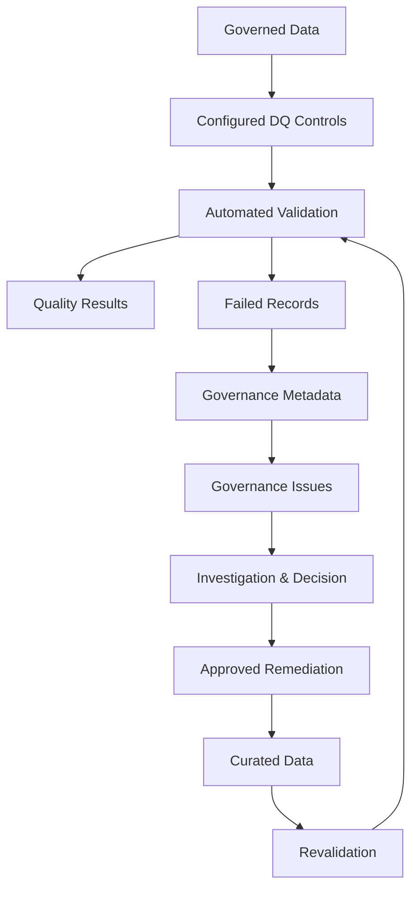
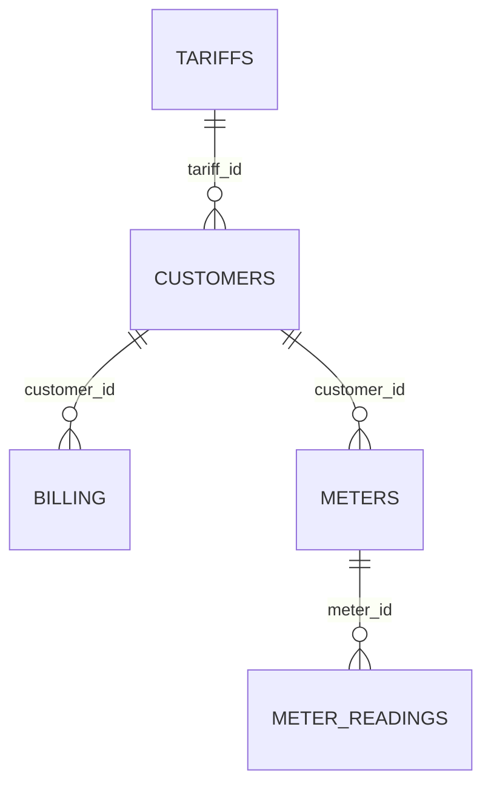
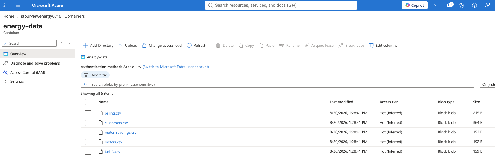
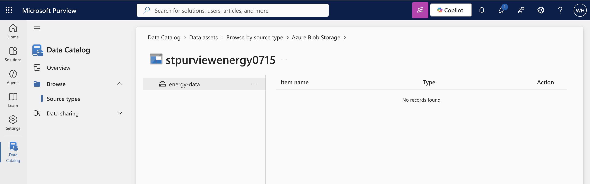

# Energy Data Governance | Microsoft Purview & Python


## Overview

This project demonstrates a metadata-driven data governance framework for a synthetic energy data environment covering Customer, Billing, Metering, and Tariff domains.

The implementation combines structured governance metadata with a configuration-driven Python data quality workflow to demonstrate:

- Business glossary and governed data elements
- Domain ownership and stewardship
- Critical Data Elements (CDEs) and data classification
- Configurable data quality controls
- Governance issue generation and routing
- Controlled remediation and revalidation
- Governance monitoring and escalation
- Alignment with Microsoft Purview capabilities

Governance definitions are maintained separately from executable controls and Python logic. This reduces duplication and allows ownership, business terminology, classifications, and quality requirements to evolve independently.

This repository uses synthetic data to demonstrate the governance design and implementation.

## Table of Contents

- [Architecture](#architecture)
- [Governance Metadata Model](#governance-metadata-model)
- [Data Domains](#data-domains)
- [Governance Framework](#governance-framework)
- [Configuration-Driven Data Quality](#configuration-driven-data-quality)
- [Demonstrated Outcome](#demonstrated-outcome)
- [Microsoft Purview Alignment](#microsoft-purview-alignment)
- [Azure and Microsoft Purview Environment](#azure-and-microsoft-purview-environment)
- [Project Structure](#project-structure)
- [How to Run](#how-to-run)
- [Limitations and Production Considerations](#limitations-and-production-considerations)


## Architecture

The project separates governance metadata, executable data quality controls, automated processing, and human governance decisions.



Python automates validation, failure evidence generation, governance metadata enrichment, approved remediation execution, and revalidation.

Business impact assessment, root cause analysis, remediation decisions, approvals, and escalation remain governance responsibilities requiring appropriate organisational context.


## Governance Metadata Model

Operational governance metadata is maintained as structured configuration rather than duplicated across governance documents.

| Metadata | Purpose |
| --- | --- |
| [`business_glossary.csv`](config/business_glossary.csv) | Maintains governed business terms and definitions |
| [`domain_ownership.csv`](config/domain_ownership.csv) | Defines accountability and stewardship by governance domain |
| [`governed_data_elements.csv`](config/governed_data_elements.csv) | Maps governed data elements to business terms, CDE status, and classification |
| [`data_quality_rules.csv`](config/data_quality_rules.csv) | Defines executable data quality controls, thresholds, severity, and validation parameters |
| [`rule_governance_mapping.csv`](config/rule_governance_mapping.csv) | Associates data quality controls with governance domains and issue context |

This structure provides reusable relationships between technical data elements, business terminology, governance accountability, classification, criticality, and executable controls.


## Data Domains

The demonstration uses five related datasets governed across four business domains.

| Domain | Datasets | Scope |
| --- | --- | --- |
| **Customer** | `customers` | Customer identity, contact information, status, and tariff assignment |
| **Billing** | `billing` | Invoices, charges, and payment information |
| **Metering** | `meters`, `meter_readings` | Meter master data, customer relationships, readings, and consumption |
| **Tariff** | `tariffs` | Energy products, pricing plans, energy types, and unit rates |



The relationships also support referential integrity controls within the data quality framework.


## Governance Framework

Governance documentation defines the reusable policies and operating principles, while implementation-specific metadata is maintained in the configuration layer.

| Document | Purpose |
| --- | --- |
| [Governance Framework](governance/governance-framework.md) | Defines governance principles, domains, accountability, CDEs, decision rights, lifecycle, and monitoring |
| [Business Glossary](governance/business-glossary.md) | Defines how governed business terminology is proposed, approved, published, and maintained |
| [Data Quality Framework](governance/data-quality-framework.md) | Defines data quality dimensions, control design, severity, lifecycle, execution, and monitoring |
| [Data Quality Issue Management](governance/issue-management.md) | Defines issue assessment, investigation, remediation, revalidation, closure, and escalation |
| [Data Protection and Access](governance/data-protection-and-access.md) | Defines classification, protection, access governance, privacy considerations, and exceptions |

The documents intentionally avoid maintaining dataset-level definitions, ownership assignments, classifications, and individual quality rules. Those details are maintained in the structured metadata layer.


## Configuration-Driven Data Quality

The Python rule engine executes controls defined in [`data_quality_rules.csv`](config/data_quality_rules.csv).

The current implementation contains **27 data quality rules** covering:

- Completeness
- Uniqueness
- Validity
- Referential integrity

Supported checks include null validation, uniqueness, allowed values, email format, numeric bounds, and foreign-key relationships.

Rules define the data being evaluated, validation logic, required threshold, severity, record identifier, and optional validation parameters.

Because rule definitions are external to the execution logic, additional controls can be introduced without changing the core pipeline when the required check type is already supported.

When controls fail, record-level evidence is enriched with governance metadata to create traceable issues containing ownership, stewardship, business context, CDE status, and classification.

Approved remediation actions are maintained in [`remediation_actions.csv`](remediation/remediation_actions.csv). The same configured controls are then re-executed against remediated data to provide evidence that the required quality thresholds have been restored.

Root cause analysis, business impact assessment, and remediation decisions remain subject to appropriate governance and business review.


## Demonstrated Outcome

The synthetic raw data contains three intentional control failures used to demonstrate the end-to-end governance workflow.

| Outcome                    |     Raw | After Remediation |
| -------------------------- | ------: | ----------------: |
| Controls Meeting Threshold | 24 / 27 |           27 / 27 |
| Control Pass Rate          |   88.9% |              100% |
| Failed Records             |       3 |                 0 |
| Critical Issues            |       1 |                 0 |
| High Issues                |       2 |                 0 |

The workflow identifies the failures, enriches them with governance context and accountability, applies approved remediation actions, and revalidates the affected data against the same configured controls.


## Microsoft Purview Alignment

The governance model is designed around capabilities commonly implemented through Microsoft Purview and related enterprise governance processes.

| Governance Capability | Project Implementation | Purview Alignment |
| --- | --- | --- |
| Business terminology | Structured business glossary | Unified Catalog / glossary capabilities |
| Ownership and stewardship | Domain accountability metadata | Governance domains and ownership |
| Governed data elements | Business-term and governance metadata mapping | Data asset metadata |
| Data classification | Classification metadata | Classifications and sensitivity capabilities |
| Critical Data Elements | CDE designation in metadata | Critical data governance |
| Data quality | Configuration-driven Python controls | Data Quality concepts |
| Issue management | Governance-enriched issue register | Governance workflow integration |
| Metadata relationships | Dataset, element, term, domain, and control mappings | Catalog and lineage concepts |

The repository demonstrates the governance design independently of a specific governance platform so that the operating model and metadata relationships remain portable.


## Azure and Microsoft Purview Environment

Synthetic energy datasets were uploaded to Azure Blob Storage as part of the project environment.



*Azure Blob Storage environment used for the synthetic energy datasets.*

Microsoft Purview Data Catalog was also explored for source discovery and catalogue integration.



*Microsoft Purview Data Catalog showing the Azure Blob Storage source during catalogue integration.*

Full Microsoft Purview Enterprise implementation could not be completed because of the available Azure subscription and regional constraints. Source scanning, catalogue ingestion, and automated classification are therefore not presented as completed capabilities.

The repository implements the platform-independent governance model and automation directly, while documenting how those components align with Microsoft Purview capabilities.


## Project Structure
<details>
<summary>View repository structure</summary>

```text
.
├── config/
│   ├── business_glossary.csv
│   ├── data_quality_rules.csv
│   ├── domain_ownership.csv
│   ├── governed_data_elements.csv
│   └── rule_governance_mapping.csv
│
├── data/
│   ├── raw/
│   │   ├── billing.csv
│   │   ├── customers.csv
│   │   ├── meter_readings.csv
│   │   ├── meters.csv
│   │   └── tariffs.csv
│   └── curated/
│       ├── billing.csv
│       ├── customers.csv
│       ├── meter_readings.csv
│       ├── meters.csv
│       └── tariffs.csv
│
├── data-quality/
│   └── results/
│       ├── raw/
│       │   ├── data-quality-results.csv
│       │   ├── failed-records.csv
│       │   └── data-quality-issues.csv
│       └── curated/
│           ├── data-quality-results.csv
│           └── failed-records.csv
│
├── governance/
│   ├── business-glossary.md
│   ├── data-protection-and-access.md
│   ├── data-quality-framework.md
│   ├── governance-framework.md
│   └── issue-management.md
│
├── remediation/
│   └── remediation_actions.csv
│
├── scripts/
│   ├── apply_remediation.py
│   ├── data_quality_checks.py
│   ├── generate_issue_register.py
│   └── rule_engine.py
│
├── screenshots/
├── README.md
└── requirements.txt
```
</details>

## How to Run

Create and activate a virtual environment:

```bash
python3 -m venv .venv
source .venv/bin/activate
```

Install dependencies:

```bash
pip install -r requirements.txt
```

Run the complete workflow:

```bash
# Validate raw data
python scripts/data_quality_checks.py --stage raw

# Generate governance issues
python scripts/generate_issue_register.py

# Apply approved remediation
python scripts/apply_remediation.py

# Revalidate curated data
python scripts/data_quality_checks.py --stage curated
```


## Limitations and Production Considerations

This repository uses synthetic data and illustrative governance metadata, controls, ownership assignments, and remediation actions.

A production implementation would typically integrate with authoritative data sources, enterprise metadata and lineage platforms, identity and access management, operational workflows, monitoring, and approval processes.

Data quality remediation should occur at the appropriate authoritative source where feasible. Governance definitions, CDE designation, classifications, quality thresholds, ownership, and decision rights would require validation and approval by relevant business, technical, privacy, security, legal, and regulatory stakeholders.