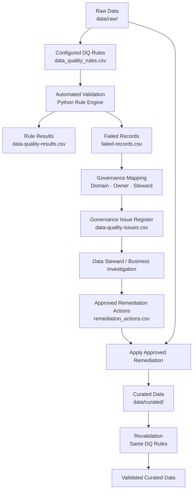

# Data Quality Framework

## Purpose

This framework defines how data quality is measured, monitored, governed, and remediated across the Customer, Billing, Metering, and Tariff data domains.

Data quality requirements and governance ownership are maintained as configuration and executed through a reusable Python rule engine. Detected failures are assigned to predefined governance roles for investigation, followed by approved remediation and revalidation.

## Data Quality Dimensions

The framework evaluates data using four data quality dimensions:

| Dimension | Description | Example |
| --- | --- | --- |
| Completeness | Required data is populated. | Customer ID must not be null. |
| Uniqueness | Identifiers expected to be unique contain no duplicates. | Reading ID must be unique. |
| Validity | Values conform to defined formats, ranges, or permitted values. | Energy consumption must not be negative. |
| Referential Integrity | Relationships between datasets reference valid records. | A meter must reference an existing customer. |

## Data Quality Configuration

Data quality requirements and governance ownership are maintained separately from the Python execution logic using two configuration files:

| Configuration | Purpose |
| --- | --- |
| [`data_quality_rules.csv`](../config/data_quality_rules.csv) | Defines what is validated, how each check is performed, and the required threshold and severity |
| [`governance_mapping.csv`](../config/governance_mapping.csv) | Defines the business domain, issue description, Data Owner, and Data Steward associated with each rule |

### Data Quality Rules

`data_quality_rules.csv` is the source of truth for the validation rules executed by the Python rule engine.

Each rule defines:

| Field | Purpose |
| --- | --- |
| `rule_id` | Unique identifier for the rule |
| `dataset` | Dataset evaluated by the rule |
| `column` | Column evaluated by the rule |
| `dimension` | Data quality dimension |
| `check_type` | Validation logic executed by the rule engine |
| `target` | Minimum required pass rate |
| `severity` | Governance priority if the rule fails |
| `record_id_column` | Identifier used to trace failed records |
| `parameter` | Optional value required by the validation logic |

The current configuration contains **27 rules across five datasets and four business data domains**, covering completeness, uniqueness, validity, and referential integrity.

Rule definitions and thresholds are maintained directly in the configuration file rather than duplicated in this document.

### Governance Mapping

Each rule has a corresponding entry in `governance_mapping.csv` that defines how a failure should be routed for governance review.

| Field | Purpose |
| --- | --- |
| `rule_id` | Links the governance mapping to the validation rule |
| `domain` | Business data domain associated with the rule |
| `issue_description` | Standard description used when the rule fails |
| `data_owner` | Role accountable for data within the domain |
| `data_steward` | Role responsible for coordinating issue investigation and resolution |

Governance mappings are defined in advance for all configured rules. When a rule fails, the mapping provides the governance context used to generate the issue register.

Only failed rules produce active governance issues.

## Data Quality Governance Workflow

The workflow combines automated validation with predefined governance ownership, human investigation, controlled remediation, and revalidation.

Validation is first performed against `data/raw/`. The rule engine evaluates the datasets against the configured requirements and produces rule-level results and record-level failure details.

Failed records are combined with the predefined governance mappings to generate issues with assigned domains, Data Owners, and Data Stewards. The relevant Data Steward, business team, or technical team investigates each issue and determines the appropriate corrective action.

Approved remediation actions are recorded separately in `remediation/remediation_actions.csv` and applied to copies of the raw datasets to produce `data/curated/`. The original raw data remains unchanged.

The same configured rules are then executed against the curated datasets to verify the remediation outcome.

## Severity Model

| Severity | Meaning | Expected Governance Response |
| --- | --- | --- |
| Critical | Issue may compromise key relationships, identifiers, or essential data integrity. | Immediate investigation and escalation to the responsible Data Owner and Data Steward |
| High | Issue materially affects data reliability or business use. | Prioritised investigation and remediation by the responsible Data Steward |
| Medium | Issue affects data consistency but has lower immediate business impact. | Review and remediation through the normal governance process |

Severity determines the governance priority of a failed rule. Root cause analysis and remediation decisions require investigation and business context.

## Governance Responsibilities

| Role | Data Quality Responsibility |
| --- | --- |
| Data Steward | Reviews failed records, coordinates root cause investigation, proposes remediation actions, and confirms that corrected data meets the relevant quality requirements |
| Data Owner | Accountable for data quality within the domain and approves significant remediation or escalation decisions where required |
| Data Governance Forum | Provides escalation and cross-domain decision support for issues that cannot be resolved within a single data domain |
| Technical / Business Teams | Support investigation and remediation where issues originate from source systems, pipelines, or operational processes |

## Production Considerations

The datasets, thresholds, severity levels, governance mappings, and roles in this repository are illustrative.

In a production environment, data quality requirements and ownership would be agreed with relevant business and technical stakeholders. Validation would typically run within scheduled data pipelines, with monitoring, alerting, workflow management, source-system remediation, lineage, and governance tooling integrated into the wider enterprise data platform.