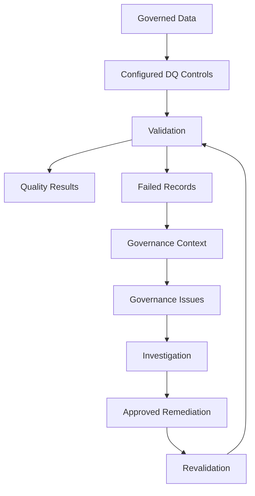

# Data Quality Framework

## Purpose

This framework defines how data quality requirements are established, measured, monitored, and managed.

Data quality controls should be business-aligned, risk-based, measurable, and traceable to the governed data they protect. Executable requirements are maintained as structured configuration so that controls can evolve independently of validation logic and governance documentation.

Data quality management operates within the accountability, decision, and escalation model defined in the [Governance Framework](governance-framework.md).

## Data Quality Dimensions

The framework evaluates data quality across four dimensions.

| Dimension | Description |
| --- | --- |
| **Completeness** | Required data is present and populated. |
| **Uniqueness** | Values expected to uniquely identify records do not contain inappropriate duplicates. |
| **Validity** | Values conform to defined formats, ranges, permitted values, or business constraints. |
| **Referential Integrity** | Relationships between data assets reference valid records. |

Additional dimensions may be introduced where required by business context or risk.

## Control Design

Data quality controls translate business and governance requirements into measurable validation rules.

Each control should define:

- The data element being evaluated
- The applicable data quality dimension
- The validation logic
- The required quality threshold
- The severity of failure
- Sufficient information to trace affected records

Controls should be proportionate to the criticality and business impact of the governed data. Critical Data Elements should receive appropriate controls where quality failures could materially affect business processes, reporting, customer outcomes, or regulatory obligations.

Executable data quality controls, including validation logic, thresholds, and severity, are maintained in [`data_quality_rules.csv`](../config/data_quality_rules.csv).

## Thresholds and Severity

Quality thresholds define the minimum acceptable level for each control and should reflect business requirements and risk tolerance. Thresholds should be reviewed as business requirements, data usage, or risk change.

Severity represents the governance priority and potential impact of a control failure.

| Severity | Meaning | Expected Response |
| --- | --- | --- |
| **Critical** | Failure may materially compromise essential data integrity, key relationships, or business processes. | Immediate investigation and escalation where required |
| **High** | Failure materially affects data reliability or business use. | Prioritised investigation and remediation |
| **Medium** | Failure affects data consistency with lower immediate business impact. | Review and remediation through the normal governance process |

Severity supports prioritisation and escalation. Root cause and remediation decisions require investigation and business context.

## Data Quality Lifecycle

Data quality management follows a continuous control lifecycle.

| Stage | Purpose |
| --- | --- |
| **1. Define** | Establish measurable quality requirements based on business meaning, criticality, and risk. |
| **2. Validate** | Execute configured controls against governed data. |
| **3. Monitor** | Measure control performance and identify failures. |
| **4. Investigate** | Establish the governance context, affected data, business impact, and root cause of identified issues. |
| **5. Remediate** | Coordinate and apply approved corrective actions. |
| **6. Revalidate** | Re-execute the relevant controls to confirm that quality requirements have been restored. |

Material or unresolved failures may be escalated at any stage according to the Governance Framework.

Where possible, remediation should address the underlying source of a quality issue to reduce recurrence.

## Control Execution

The implementation separates data quality control definition, execution, and governance metadata.

Validation produces both control-level results and record-level failure evidence.

Where failures require governance action, they are enriched with governance metadata so that issues can be routed, investigated, remediated, and revalidated.

Rule-level governance context is maintained in [`rule_governance_mapping.csv`](../config/rule_governance_mapping.csv), with domain accountability maintained in [`domain_ownership.csv`](../config/domain_ownership.csv) and data element governance metadata maintained in [`governed_data_elements.csv`](../config/governed_data_elements.csv).

Control execution may be automated, while root cause analysis and remediation decisions remain subject to appropriate governance accountability and business context.

## Data Quality Monitoring

Monitoring should provide visibility into both control performance and issue outcomes.

Relevant measures may include:

* Overall and domain-level quality performance
* Control pass rates
* Failures by severity
* Affected record counts
* Open data quality issues
* Remediation outcomes
* Revalidation success
* Control coverage for Critical Data Elements

Monitoring should support prioritisation, investigation, and continuous improvement.

Targets, reporting cadence, escalation thresholds, and service levels should be defined according to organisational requirements and risk appetite.

## Production Considerations

This repository demonstrates the framework using synthetic data, illustrative requirements, and a configuration-driven validation workflow.

In a production environment:

* Data quality requirements, thresholds, severity levels, and control coverage should be agreed with relevant business and technical stakeholders and reviewed as requirements and risks evolve.
* Controls should be integrated into appropriate data pipelines, monitoring, and operational workflow mechanisms.
* Remediation should normally occur at the appropriate authoritative source where feasible.
* Metadata, lineage, observability, and governance platforms may provide additional context, traceability, and automation.